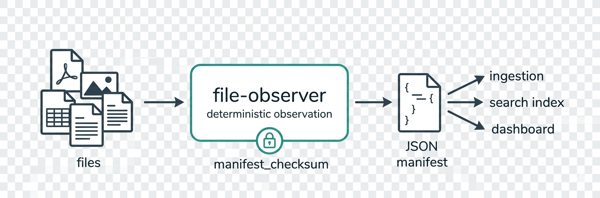

# file-observer tutorial

A guided tour, from first scan to pipeline integration. Every section links to a
runnable [example](../examples/). Stable section anchors — external posts link
here, so the headings don't churn.

> **New to the project?** file-observer is a **deterministic observation layer**:
> point it at a directory and get back a JSON manifest describing every file —
> its type, metadata, structure, and provenance — reproducibly enough to trust in
> a pipeline. It is **not** a file watcher, an ingester, an OCR engine, or a
> classifier — it observes and reports; you decide what to do with the
> observation. *(If you already know Apache Tika: think a deterministic Tika
> built for pipelines.)*

## 1. What it is (and is not)

**Is:** a one-shot, read-only scan of a directory that emits a deterministic JSON
manifest. Identical bytes in → identical manifest out (modulo a scan id and
timestamp, which are excluded from the checksum). Every derived field records
*how* it was derived. Specialists pull structured metadata per format. Vectors
aggregate signals across the corpus.

**Is not:** it never executes file content, modifies your files, opens network
connections, or runs embedded scripts/macros. Its whole job is to *look* and
*describe*. The `--watch` mode (§9) re-runs the same one-shot scan on filesystem
events — it's a trigger loop around the deterministic observer, not an
intelligent watcher.

<p align="center">
  
</p>

Why determinism matters: in an ingestion pipeline you want the same file to
produce the same record every run, so you can cache, diff, and trust the output.
The `manifest_checksum` is the handle for that (§4, [Example 04](../examples/04-determinism/)).

## 2. Install

```bash
pip install file-observer
```

Optional extras for richer extraction:

```bash
pip install "file-observer[all]"      # every optional specialist (one line — recommended)
pip install "file-observer[pdf]"      # object-stream + encrypted PDF metadata (pypdf + cryptography)
pip install "file-observer[msg]"      # OLE2 .msg/.doc/.xls/.ppt (olefile)
pip install "file-observer[security]" # hardened XML parsing (purexml — pure-stdlib, adds structural caps)
pip install "file-observer[watch]"    # --watch FS-event mode (watchfiles)
pip install "file-observer[mcp]"      # the file-observer-mcp agent server (see §10)
```

Or run it with **no install** (zero-setup, from PyPI), or in a container with no Python at all:

```bash
uvx file-observer ./folder --stdout         # uv: zero-install + cached (also `pipx run file-observer`)
docker run --rm -v "/path:/data:ro" ghcr.io/russalo/file-observer > manifest.json
```

The CLI is `file-observer` (or the shorthand `fo`). From Python: `from file_observer import scan; m = scan("./folder")`. In CI: `uses: russalo/file-observer@<tag>`.

## 3. Your first scan

→ [Example 01](../examples/01-first-scan/)

```bash
file-observer path/to/folder -o out          # writes out/manifest_….json + a report
file-observer path/to/folder --stdout | jq   # or pipe the manifest to stdout (no file written)
```

…or in Python, one call:

```python
from file_observer import scan
m = scan("path/to/folder")                    # returns the manifest (m.summary, m.files, …)
```

You get `out/manifest_v{VERSION}_{timestamp}.json` (the structured record) and a
`report_….md` (a human summary). One `FileRecord` per discovered file: identity,
filesystem metadata, checksum, content-detected MIME, routing flags, and — when
enabled — specialist metadata.

MIME is detected from **content**, not the extension: rename `logo.png` to
`logo.txt` and file-observer still reports `image/png`.

## 4. Reading a FileRecord

→ [Example 01](../examples/01-first-scan/), [Example 02](../examples/02-pdf-metadata/)

The fields that matter most in a pipeline:

- `checksum_sha256` — content identity; dedup and change-detection key.
- `mime_type` + `mime_analysis` — detected MIME, and whether it matches the extension.
- `is_binary`, `requires_specialist_tool`, `requires_vision` — derived routing flags.
- `signal_provenance` — per-derived-field record of *how* it was derived (`layer`,
  `method`, `trigger`). Nothing derived is unexplained.
- `safety_flags` — structural indicators (`has_javascript`, `has_macros`,
  `geotagged`, …) — observations, never threat verdicts.
- `preservation` — a format-obsolescence signal (`current` / `at_risk` /
  `obsolete`, plus `migration_recommended`) for archival triage.

`manifest_checksum` (top level) is the SHA-256 over the whole manifest minus the
volatile `scan_id`/`generated_at`. It is the determinism contract.

## 5. Specialists — per-format extraction

→ [Example 02](../examples/02-pdf-metadata/)

By default file-observer stays at the universal/baseline tiers (fast, no format
parsing). Add `--specialists` to pull structured metadata per format:

```bash
file-observer path/to/folder --specialists -o out
```

PDF yields `page_count`, `producer`, `xref_type`, encryption state, …; **images**
(JPEG/HEIC) yield dimensions *plus* EXIF capture metadata — `make`/`model`,
`orientation`, `datetime_original`, `gps_present`, `xmp_present`; **video**
(`.mp4`/`.mov`/`.m4v`) yields `codec`, `duration_s`, dimensions, capture dates
(`creation_date` and the timezone-bearing `creation_date_qt`), and Apple-device
`make`/`model` + GPS-presence; Office formats yield author/title/application
(plus word/heading counts, sheet names, slide counts); **audio** (`.mp3`) yields
format/bitrate/duration plus ID3 tags (title/artist/album/year); emails yield the
envelope (subject/from/to/date). GPS-presence on a photo or video also raises the
`geotagged` safety flag. Specialists observe within declared byte bounds —
`null` means "not seen within bounds," not "absent."

## 6. Chatlog detection

→ [Example 03](../examples/03-chatlog-detection/)

file-observer detects conversational structure by **content**, not extension. A
`.md` or `.txt` or `.jsonl` whose content reads as a dialogue (speaker turns,
or role/content JSON across ConvoKit / ShareGPT / oasst / hh-rlhf schemas) gets
`is_chatlog: true` and a `chatlog` vector with turn counts, speakers, and shape
signals. This runs even with specialists disabled, and recognizes agentic
(tool-turn) AI sessions, not just prose dialogue.

**AI-session logs go further.** When a chatlog is an AI coding/assistant session
(Claude Code / OpenAI / Gemini), the `ai_session` namespace observes token-usage
**sums** — per session and **per model** (`usage_by_model`) — plus a producer-schema
fingerprint (which vendor/surface produced it), and the chatlog block carries the
session's time span (`first_timestamp`/`last_timestamp`) and working directory
(`cwd`) as flat scalars. Observe-only: token sums are recorded, **never priced**.
That's what lets a downstream index answer "what did the fleet burn — by model, by
week, by project" without file-observer ever leaving the observation layer.

## 7. Discovering the full output surface

→ [Example 06](../examples/06-schema-discovery/)

You don't have to guess what file-observer can emit. Ask it:

```bash
file-observer --schema                      # complete surface, JSON
file-observer --schema --schema-format md   # human-readable
```

It prints every manifest field, every specialist + its metadata fields, every
vector, safety_flag, error code, provenance trigger, format signature, and
preservation tier — introspected from the installed build, so it's always
accurate. This is the reference when you're writing a consumer.

## 8. Determinism and deltas in a pipeline

→ [Example 04](../examples/04-determinism/), [Example 05](../examples/05-delta-scan/)

- **Determinism:** scan the same bytes twice → identical `manifest_checksum`.
  Cache on it; trust it.
- **Deltas:** pass `--previous-manifest prev.json` and the manifest gains a
  `delta` block — `added` / `modified` / `removed` / `unchanged` /
  `rescan_candidates` — so a pipeline only re-processes what changed.

## 9. Going faster, and continuous mode

→ [Example 07](../examples/07-parallel-scan/)

- **Parallel:** `--workers N` scans files across a process pool. The output is
  **byte-identical regardless of N** — parallelism changes speed, never the
  observation.
- **Continuous:** `--watch` re-runs the scan on filesystem events and emits each
  scan's delta as one JSONL line on stdout. Each emitted scan is byte-identical
  to a one-shot invocation at that filesystem state. Pipe it into a consumer for
  near-real-time observation. (Requires the `[watch]` extra.)

## 10. Use it from an AI agent (MCP)

→ [Example 08](../examples/08-mcp-server/)

`file-observer[mcp]` runs an [MCP](https://modelcontextprotocol.io/) server so an AI agent can
scan a file tree as a tool — a safe **"look before you touch"** pass over unknown or untrusted
files. Because file-observer is read-only, never executes content, stays in-tree, and never
crashes, an agent can point it at files it doesn't trust and get a deterministic manifest of
*what's there* before opening or ingesting anything — an observation, not a verdict.

Run `file-observer-mcp` (stdio), then add it to your MCP client (Claude Desktop / Claude Code):

```json
{ "mcpServers": { "file-observer": { "command": "file-observer-mcp" } } }
```

Four read-only tools, built for an agent's context budget (progressive disclosure):
`scan_summary` (compact overview — **start here**; ~300 tokens on a big folder), `scan_file`
(one file's full record), `scan_directory` (the full manifest, guarded by file count),
`describe_surface` (the output schema). `--root <dir>` restricts scans to a subtree. The tools
**observe and report** — the agent interprets. This exposes the *same* manifest you get from the
CLI (§3), through a protocol an agent can call directly.

More scanner capabilities thread through the tools: start the server with `--lexicon <path>`
(or `--lexicon-index`) to apply a bring-your-own term lexicon (§12) to every scan — the
guardrail-risk **pre-screen**, so an agent can flag content that might trip *its own* content filter
before ingesting it (the terms live in the config file, never in the agent's context; only per-category
counts come back). Per-call tool params mirror the CLI safe surfaces: `trusted_only=true` (§11) and
`receipt=true` (§13). And pass `previous_manifest_path` to `scan_directory`/`scan_summary` for a **delta**
(what changed since a prior scan) — the agentic-loop version of §8's `--previous-manifest`.

## 11. Safe mode: feeding untrusted files to a model

→ [Example 09](../examples/09-trusted-only/)

file-observer never executes file content, so the **scanner** can't be prompt-injected. But the **manifest is a report *about* untrusted input** — it echoes attacker-controllable strings verbatim: `path`/`filename`, `content_preview`, `tags`, frontmatter, and extracted metadata (a PDF/doc author, an EXIF make/model, an email subject, a chatlog speaker label). A file named `ignore_previous_instructions.md` (like the one in example 09) puts that string straight into the manifest — paste a raw manifest into a model's context and you've handed it whatever an attacker wrote.

Every field is classified on one axis — **can it carry attacker-controlled free text?**

- **`fo_derived` (trusted):** numbers, booleans, hashes, MIME types, enums, `safety_flags`, timestamps, sizes — things file-observer *computed*. A `page_count` of `5` can't be a prompt, even though it came from the file.
- **`file_derived` (untrusted):** the verbatim bytes above.

`--trusted-only` emits a **projection** that keeps only the `fo_derived` fields and strips every `file_derived` value (string fields go `null`; path lists and vector summaries go `[]`/`{}`) — across the *whole* manifest (per-file fields, the `summary` prose, `meta.source_dir`, duplicate-cluster and delta paths, per-directory names, vector summaries), in JSON and JSONL:

```bash
file-observer ./untrusted-uploads --trusted-only --stdout | your-llm-pipeline
```

The output is safe by construction to feed a model — it only ever sees file-observer's own signal. Two things keep it usable: a per-file **`path_id = sha256(<relative path>)`** replaces the nulled `path` (a correlation handle carrying no free text — map it back to a path you hashed yourself), and a top-level **`trusted_only: true`** marker.

It's the guardrail **pre-screen**: file-observer isn't an AI, so it can safely *read* files that would be risky to hand an LLM directly — you get pure signal (types, flags like `has_macros`/`geotagged`, counts) and decide what to do *before* any bytes reach a model. The same mode is available to an agent through the MCP server (§10): the `trusted_only` tool param, or a server-wide `--trusted-only`.

Two honest caveats:

- **It's a projection, not a sanitizer, and it over-suppresses by design** (fail-safe: unsure ⇒ dropped). It also drops genuinely-useful things — the human `summary`, corpus vector summaries, even fo-enum strings like `codec`. Use the **default** manifest when you want those; `--trusted-only` only for the feed-to-a-model case.
- Want a *different* cut? Read each field's `trust` attribute from `--schema` (§7) and build your own projection.

## 12. Content signals: bring your own lexicon

→ [Example 10](../examples/10-lexicon-screen/)

Safe mode (§11) strips *attacker* text out. The **lexicon** is the other half — *your own* signal
in. Give file-observer a consumer-supplied, category-tagged term list and it counts those terms per
file and raises a `lexicon_match` safety_flag on any hit — a cheap, deterministic **content pre-screen**.
file-observer isn't an AI, so it can safely read files an LLM shouldn't, and tell you *which* are a
guardrail-trip risk before any bytes reach a model. It's an **observation, never a verdict** — you set
the threshold.

```bash
file-observer ./untrusted-uploads --specialists --lexicon terms.txt --stdout
```

The lexicon is either **JSON** (`{"lexicon_id": "...", "categories": {"cat": ["term", …]}}`) or an
**EasyList-style text** list — `! Title:` header, `[category]` sections, one literal term per line,
`!`/`#` comments. It's **repeatable** (`--lexicon a.txt --lexicon b.json`, unioned, order-independent),
and `--lexicon-index lists.txt` composes a whole subscription of member lists. file-observer composes
**local** files — it never fetches; keep the lists current with whatever tool you like.

What you get back (dormant unless a lexicon is supplied — no lexicon means the default manifest is
byte-identical):

- a `specialist_metadata.lexicon_match` block per text file — per-category **counts + density** for the
  file's body, plus a `metadata` sub-block that runs the same match over file-derived metadata a body
  scan can't see (a filename, an EXIF make/model, a PDF producer/title/author);
- a corpus `lexicon` vector with per-category totals and a content-hash **`dictionary_id`** (moves on any
  term change → catches silent list drift).

**The terms stay private.** Only counts, category names, and the `dictionary_id` ever reach the manifest —
your sensitive list lives in a config file file-observer never echoes (not into the manifest, not into
error logs). One nuance: a term that *also* appears in a scanned document's body shows up in that file's
`content_preview` — as the document's own untrusted content, not as a lexicon term; strip those with
`--trusted-only` (§11).

## 13. Screening receipts

`--receipt` projects a built manifest into a compact, tamper-evident **audit record** — an envelope
(versions, `manifest_checksum` + signature, `scan_id`, `dictionary_id`) plus a per-file entry
(`receipt_id`, `path_id`, checksum, size, mime, `safety_flags`, and a lexicon hit-summary when a lexicon
ran):

```bash
file-observer ./untrusted-uploads --specialists --lexicon terms.txt --receipt --stdout
```

The **`receipt_id`** is a sha256 over a length-prefixed `(manifest_checksum + path + file hash)` — the
explicit join key a downstream read/skip log references, so file-observer's observation and your
orchestrator's decision *actually meet*. It's independently recomputable (verifiable), tamper-evident,
and **safe by construction** (no raw path — `path_id` correlates), so a receipt is safe to persist *and*
to feed a model. file-observer records only what it *saw*; it never records what you then *did* with a
file — that stays your orchestrator's log.

Together, §12 → §11 → §13 are the "consume untrusted files safely" arc: **detect** (lexicon screen) →
**safe hand-off** (`--trusted-only`) → **audit bridge** (`--receipt`).

## Where to go next

- The [examples](../examples/) — runnable, one per concept (incl. [08 — the MCP server](../examples/08-mcp-server/), [09 — safe mode](../examples/09-trusted-only/), and [10 — lexicon screen](../examples/10-lexicon-screen/)).
- [`docs/SCHEMA.md`](SCHEMA.md) — the complete output surface (generated by `--schema`).
- [`docs/PUBLIC_CONTRACT.md`](PUBLIC_CONTRACT.md) — what's stable to build against.
- [`docs/LIMITATIONS.md`](LIMITATIONS.md) — what file-observer deliberately doesn't do.
