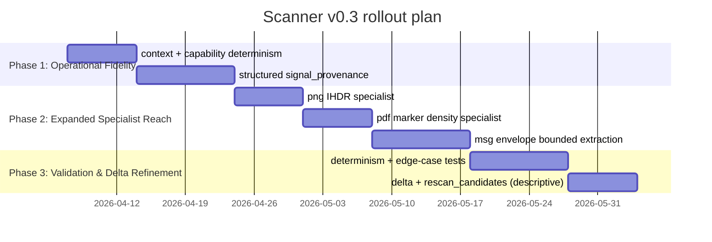

# Scanner v0.3.0 RFC Specification

## Executive summary

This RFC defines an **authoritative, implementable** v0.3.0 specification for the `scanner` package by merging two candidate drafts into a single, coherent contract. The merged design preserves the v0.2 operational contract and data model while introducing three v0.3 pillars:

- **Capability-locked determinism**: deterministic results are guaranteed **conditional on an explicit ScanContext fingerprint** (logic version + runtime + dependency availability/versions), eliminating “universal determinism” blind spots caused by differing `libmagic`/magic DB builds and `chardet` behaviors. citeturn0search0turn0search4turn0search2turn0search10  
- **Layered signals + structured provenance**: every signal is explicitly categorized as **Raw**, **Derived**, or **Semantic-local** (reserved for future opt-in), and every non-trivial value includes **machine-readable `signal_provenance`** instead of an execution-style process log. Normative requirement language uses **BCP 14** keywords. citeturn1search1turn1search2  
- **Bounded observation mandate**: format specialists operate within a **bounded read window** (default `sample_size=8192` bytes), with explicit null semantics (“null means not observed within bounds”) and a formal mechanism for **explicit, documented deviations**. This maintains predictable performance and auditability.

This RFC also specifies deterministic serialization and hashing (using a canonicalization scheme inspired by JSON canonicalization standards), a complete data model definition (including `ScanManifest`, `FileRecord`, etc.), explicit routing flag semantics, specialist behaviors for **PDF**, **PNG**, **MSG**, and structural extraction for **XML**/**TOML**, plus migration guidance and a minimal acceptance checklist. citeturn2search0

## Scope, goals, non-goals, terminology

### Scope

This RFC defines the v0.3.0 behavior and output contract for the `scanner` package:

- Recursive, sorted discovery of files under a source root
- Per-file extraction of **universal**, **baseline**, **structural**, and **specialist** signals
- Emission of deterministic JSON/JSONL manifest(s) representing **file-local signals only** (no cross-file association)

### Goals

v0.3.0 MUST:

- Preserve the v0.2 manifest structure and invariants where not explicitly changed in this RFC.
- Make the manifest **self-explanatory** via layered signal definitions and structured per-field provenance.
- Provide a **ScanContext** that explains capability-related variance (capability-locked determinism).
- Enforce a **bounded observation** rule for specialist extraction, with explicit null semantics.
- Expand specialist reach into at least:
  - PNG header signals (IHDR)
  - PDF sample text marker density metric
  - MSG envelope extraction under bounded constraints (container-level, not body parsing)
- Expand structural extraction to:
  - XML root + direct children keys
  - TOML top-level keys

### Non-goals

v0.3.0 MUST NOT:

- Perform OCR, embeddings, classification, ranking, clustering, or semantic summarization.
- Cross-associate files (no graph/link inference across multiple `FileRecord`s).
- Mutate source files or write to source directories.
- Provide “automatic actions” (e.g., automatic rescans); it may emit descriptive state that downstream systems can interpret.

### Normative language

The key words **MUST**, **MUST NOT**, **SHOULD**, **SHOULD NOT**, and **MAY** are to be interpreted as described in **RFC 2119** and clarified by **RFC 8174** (BCP 14). citeturn1search1turn1search2  

### Terminology

- **Signal**: A single extracted or derived value in a manifest.
- **Layer**: One of Raw / Derived / Semantic-local, describing derivation and allowed dependencies.
- **ScanContext**: The capability fingerprint of the scanning environment that affects outputs.
- **Bounded read window**: Maximum bytes a specialist may inspect (default first `sample_size` bytes).
- **Provenance**: A structured explanation of how a signal was derived.
- **Specialist tool**: A format-aware, bounded probe that extracts format-specific metadata.

## Determinism and ScanContext

### Capability-locked determinism

v0.3.0 defines **capability-locked determinism**:

- For a fixed input file tree (same bytes at same relative paths), identical runtime configuration, and identical `ScanContext`, the scanner MUST emit identical:
  - file ordering
  - per-file signals (Raw/Derived)
  - derived routing flags
  - deterministic manifest checksum (as defined in this RFC)

Variance across environments is expected when capabilities differ (e.g., absence/presence or different version/builds of `libmagic`/magic database and `chardet`). The manifest MUST surface this variance through `ScanContext` and `signal_provenance`. `libmagic` explicitly supports version identification (e.g., `magic_version()`), and Python bindings (e.g., `python-magic`) are interfaces to that library; these dependencies can change observed MIME outputs across environments. citeturn0search0turn0search1turn0search4turn0search8  

### ScanContext contents

The manifest MUST include a top-level `context` object that fingerprints outputs-relevant capability state:

- `logic_version`: A hardcoded identifier for the decision tree and extraction logic.
- `scanner_version`: Package version (e.g., `0.3.0`).
- `python_version`: Runtime Python version string.
- `platform`: A stable platform identifier (e.g., `linux`, `darwin`, `win32`).
- `dependencies`: A map of optional dependencies that influence extraction, with:
  - `available`: boolean
  - `version`: string or `"unknown"` if undetectable but available

Dependencies that MUST be represented at minimum:

- `magic` (libmagic binding / capability)
- `chardet`
- `yaml` (PyYAML)

This is consistent with the fact that `chardet`’s inference output depends on the library’s internal pipeline and confidence model and can differ by version, so its presence/version is a determinism-relevant capability fingerprint. citeturn0search21turn0search10turn0search2  

#### Example `context`

```json
{
  "context": {
    "logic_version": "0.3.0",
    "scanner_version": "0.3.0",
    "python_version": "3.12.3",
    "platform": "linux",
    "dependencies": {
      "magic": { "available": true, "version": "5.45" },
      "chardet": { "available": true, "version": "5.2.0" },
      "yaml": { "available": false, "version": null }
    }
  }
}
```

### Hostname and other volatile fields

The `context` object MUST NOT include volatile, execution-specific identifiers that are not causally linked to scan outputs, including:

- hostname
- username
- current working directory (unless it is identical to `source_dir`, which is already specified elsewhere)
- timestamps and durations
- random values (including UUIDv4 run IDs)

If an operator requires these values for operational observability, they MAY be emitted in a separate, explicitly non-deterministic `execution_context` block that is excluded from deterministic checksum computation (see checksum rules). This RFC does not otherwise standardize `execution_context`.

## Bounded observation and signal layering

### Bounded observation mandate

v0.3.0 introduces a unified bounded observation rule for specialist extraction:

- `sample_size` MUST default to **8192 bytes** (8 KiB).
- For each file, the scanner MUST read a **sample buffer** of length `min(sample_size, size_bytes)` from the beginning of the file.
- Specialist extraction MUST NOT inspect bytes beyond the file’s declared **bounded read window**, which by default is the sample buffer.

This is consistent with the RFC’s “observation-only” discipline: the scanner reports structured signals without unbounded parsing.

#### Null semantics under bounded extraction

When a specialist signal cannot be observed within the bounded read window, the scanner MUST set the corresponding field to `null`. **`null` MUST mean “not observed within bounds,” not “not present in the file.”**

### Allowed explicit deviations

A specialist MAY deviate from the default sample-only window only if all conditions are met:

- The deviation is explicitly declared in this RFC or a future RFC that updates it.
- The deviation defines a deterministic, fixed maximum byte budget (e.g., “read at most 256 KiB total from file via bounded reader”).
- The deviation is justified as necessary for format correctness.
- The deviation is surfaced in `signal_provenance.detail` for affected signals (e.g., `detail.read_window_bytes`).

v0.3.0 is designed such that **no deviation is required** for PNG IHDR and PDF marker density; MSG envelope extraction is specified in a way that remains bounded, but implementations may choose to support an explicit deviation in a future v0.3.x clarification if the ecosystem requires it.

### Signal layering model

v0.3.0 formalizes three signal layers. Layer membership is a **contract**, not documentation.

#### Raw signals

Raw signals are direct observations from the filesystem, path, or file bytes that do not encode interpretive logic.

Raw signals MUST:

- be reproducible under capability-locked determinism
- not depend on other signals

Raw signals MAY still require provenance when multiple capability-dependent acquisition paths exist (e.g., MIME detection via libmagic vs extension fallback). citeturn0search1turn0search0  

#### Derived signals

Derived signals are deterministic computations from Raw signals and configuration. They are still “reporting the news,” but they reflect a defined decision procedure.

Derived signals MUST:

- be deterministic for identical Raw inputs, config, and `context.logic_version`
- include structured provenance

Derived signals MAY depend on other Derived signals, but where they do, provenance MUST explicitly list dependencies via `inputs`.

#### Semantic-local signals

Semantic-local signals carry interpretive weight beyond mechanical derivation but remain **file-local**.

In v0.3.0:

- Semantic-local is **reserved** and MUST NOT be emitted unless explicitly enabled via configuration (future work).
- If emitted, it MUST include `confidence` and must be fully specified by thresholds/criteria.

### Mermaid diagram: layers and provenance

```mermaid
graph TD
  A[Raw Signals] --> B[Derived Signals]
  B --> C[Semantic-local Signals<br/>(reserved, opt-in)]
  A --> P[signal_provenance]
  B --> P
  C --> P
```

## Data model and provenance

### Data model overview

The manifest MUST serialize the following records (dataclass names are normative labels; serialized JSON names are normative field names).

#### ScanManifest

```json
{
  "context": { "...": "..." },
  "meta": { "...": "..." },
  "stats": { "...": "..." },
  "routing_summary": { "...": "..." },
  "delta": null,
  "manifest_checksum": "sha256hex...",
  "files": [ { "...": "..." } ]
}
```

#### ScanMeta

Fields:

- `scan_id`: string; implementation MAY use UUIDv4 for run identification, but MUST NOT include it in deterministic checksum preimage.
- `generated_at`: ISO-8601 UTC timestamp; MUST NOT be included in deterministic checksum preimage.
- `source_dir`: absolute path string.
- `config`: snapshot of runtime config options.

#### ScanStats

Counts:

- `total_files`
- `supported_files`
- `unsupported_files`
- `text_files`
- `binary_files`
- `requires_vision`
- `requires_specialist_tool`

#### RoutingSummary

- `baseline_ready`: number of files that are text and do not require specialist tools
- `binary_only`: binary files that do not require vision or specialist
- `requires_vision`
- `requires_specialist_tool`

#### DeltaRecord

- `previous_scan_id`
- `added`, `modified`, `unchanged`, `removed` — sorted lists of relative paths
- `rescan_candidates` (NEW, optional): descriptive-only state (see delta section)

#### FileRecord

The per-file record. All arrays MUST be present (never `null`).

v0.3 adds `signal_provenance` (replacing `process_log`) and expands `specialist_metadata`.

#### StructuralRecord, FrontmatterRecord, MimeAnalysisRecord, ErrorRecord

Defined below.

### Signal provenance schema

Every `FileRecord` MUST include a `signal_provenance` map:

- Keys are canonical field paths (e.g., `"mime_type"`, `"encoding"`, `"requires_vision"`, `"structural.title"`, `"specialist_metadata.pdf.sample_text_marker_density"`).
- Values are provenance records.

A provenance record MUST have the following fields:

- `layer`: `"raw" | "derived" | "semantic_local"`
- `method`: stable token identifying the method/logic block (e.g., `"detect_mime"`, `"decode_text"`, `"detect_binary"`)
- `trigger`: stable token identifying the specific gate path (e.g., `"libmagic"`, `"extension_fallback"`, `"nul_byte"`)
- `inputs` (optional): list of canonical field paths that this signal depends on
- `detail`: object or string; additional structured explanation (must remain deterministic)
- `confidence` (semantic-local only): float in `[0.0, 1.0]`

#### Provenance example: MIME fallback

```json
{
  "mime_type": "text/plain",
  "signal_provenance": {
    "mime_type": {
      "layer": "raw",
      "method": "detect_mime",
      "trigger": "extension_fallback",
      "detail": { "extension_guess": "text/plain" }
    }
  }
}
```

This explicitly distinguishes libmagic-derived MIME (content-based header inspection) from extension-based inference, which is important because `libmagic` and its magic DB are a recognized source of environment-dependent results. citeturn0search0turn0search4turn0search8  

### Replacement of process_log

v0.3.0 MUST NOT include an execution-style `process_log`. If tier traversal information is needed for debugging, it MUST be captured as deterministic provenance on the derived outputs that resulted from traversal, rather than as a separate traversal log.

This aligns with the principle that provenance should represent “why this value exists” rather than “what steps the runtime took.”

### Record definitions

#### FrontmatterRecord

- `exists`: boolean
- `keys`: sorted list of keys
- `raw`: raw YAML frontmatter content or raw malformed fence content (deterministic preservation)

#### StructuralRecord

- `title`: string | null
- `heading_structure`: list of H2 headings (markdown only)
- `csv_headers`: list (CSV only)
- `document_keys`: list (JSON/YAML/XML/TOML only)
- `technology_hints`: list
- `filename_date`: string `"YYYY-MM-DD"` | null

#### MimeAnalysisRecord

- `detected_mime`: string | null
- `extension_mime`: string | null
- `matches_extension`: bool

#### ErrorRecord

- `code`: string enum
- `message`: string
- `stage`: `"universal" | "baseline" | "structural" | "specialist"`

### Signal layer classification table

This table maps every v0.3 `FileRecord` field (including nested) to a layer.

| Field path | Layer | Notes |
|---|---|---|
| `path` | raw | Relative path from source root; normalized to forward slashes. |
| `filename` | raw | Basename extraction from `path`. |
| `extension` | raw | Lowercased; includes dot or `""`. |
| `mime_type` | raw | Source is capability-dependent (libmagic vs extension); provenance REQUIRED. citeturn0search1turn0search0 |
| `size_bytes` | raw | Filesystem stat. |
| `created_at` | raw | May be null on platforms without `st_birthtime`. citeturn4search18turn4search21 |
| `modified_at` | raw | Filesystem stat. |
| `checksum_sha256` | raw | SHA-256 of file bytes streamed; deterministic. |
| `stage_folder` | raw | First path component. |
| `directory_depth` | raw | Component count minus 1. |
| `encoding` | derived | From chardet or cascade; provenance REQUIRED. citeturn0search21turn0search2 |
| `is_binary` | derived | Binary decision chain; provenance REQUIRED. |
| `requires_vision` | derived | From MIME + PDF text marker heuristics; provenance REQUIRED. citeturn0search7turn4search19 |
| `requires_specialist_tool` | derived | Extension/tool registry; provenance REQUIRED. |
| `specialist_tool` | derived | Tool name; null iff `requires_specialist_tool=false`. |
| `sidecar_exists` | derived | Deterministic sidecar probe; provenance recommended. |
| `frontmatter.exists` | derived | Derived from decoded markdown; provenance recommended. |
| `frontmatter.keys` | derived | Sorted extraction; provenance recommended. |
| `frontmatter.raw` | raw | Raw text within fences (or preserved malformed). |
| `tags` | derived | Deterministic extraction; provenance recommended. |
| `asset_matches` | derived | Deterministic extraction; provenance recommended. |
| `content_preview` | raw | Bounded text window (first N chars after decoding + control char stripping); null for binary files. Analogous to `frontmatter.raw` — a direct observation of file content, not an interpretation. Depends on `encoding` for decoding, but the preview value itself is not interpretive. |
| `structural.title` | derived | Deterministic extraction; provenance recommended. |
| `structural.heading_structure` | derived | Markdown-only; deterministic. |
| `structural.csv_headers` | derived | CSV-only; deterministic. |
| `structural.document_keys` | derived | JSON/YAML/XML/TOML parsing bounded to policy; deterministic. citeturn2search2turn2search1 |
| `structural.technology_hints` | derived | Regex patterns. |
| `structural.filename_date` | derived | Deterministic filename parse. |
| `mime_analysis.detected_mime` | raw | Same value as `mime_type`; provenance inherited from `mime_type`. |
| `mime_analysis.extension_mime` | raw | Direct `mimetypes.guess_type()` lookup; no interpretation. |
| `mime_analysis.matches_extension` | derived | Comparison of two raw signals; provenance REQUIRED. |
| `specialist_metadata` (object) | derived | Entire object is derived; null if not applicable or disabled. |
| `specialist_metadata.pdf.*` | derived | Sample-based PDF signals; see specialist section. citeturn0search7turn4search1 |
| `specialist_metadata.png.*` | derived | IHDR-based signals; see specialist section. citeturn1search12turn1search0 |
| `specialist_metadata.msg.*` | derived | Bounded OLE/CFB envelope signals; see specialist section. citeturn1search7turn4search6 |
| `errors[*].code` | derived | Deterministic error categorization. |
| `errors[*].message` | derived | Deterministic message content required; avoid nondeterministic OS text where possible. |
| `errors[*].stage` | derived | Deterministic stage label. |
| `signal_provenance` | derived | Deterministic map. |
| `signal_provenance.*.layer` | derived | Layer tag (raw/derived/semantic_local). |
| `signal_provenance.*.method` | derived | Stable token for logic block. |
| `signal_provenance.*.trigger` | derived | Stable token for branch. |
| `signal_provenance.*.inputs` | derived | Optional dependency list. |
| `signal_provenance.*.detail` | derived | Deterministic structured detail. |
| `signal_provenance.*.confidence` | semantic_local | Present only for semantic-local signals (reserved). |

## Extraction and routing behavior

### Capability tiers and gating

The scanner processes each file through tiers:

- **Universal tier**: ALWAYS runs, producing identity, filesystem signals, checksums, MIME detection, and core routing flags.
- **Baseline tier**: runs when `is_binary == false`.
- **Structural tier**: runs when `is_binary == false` (best-effort; must be deterministic).
- **Specialist tier**: runs when `config.enable_specialists == true` AND the file extension matches a specialist-capable type; extraction MUST be bounded.

### Supported extensions and tool roles

v0.3.0 recognizes the following extensions (expanding v0.2):

| Extension(s) | Baseline | Structural | Specialist | Specialist tool |
|---|---|---|---|---|
| `.txt` | Yes | limited | No | — |
| `.md`, `.mdx` | Yes | Yes | No | — |
| `.csv` | Yes | Yes | No | — |
| `.json` | Yes | Yes | validation probe (opt-in) | — |
| `.yaml`, `.yml` | Yes | Yes | No | — |
| `.html`, `.htm` | Yes | Yes | No | — |
| `.xml` | Yes | Yes (keys) | No | — citeturn2search2 |
| `.toml` | Yes | Yes (keys) | No | — citeturn2search1 |
| `.pdf` | No | limited | Yes | `pdf_scanner` |
| `.docx` | No | limited | No (scanner-side) | downstream `docx_parser` |
| `.rtf` | No | limited | No (scanner-side) | downstream `rtf_parser` |
| `.png` | No | limited | Yes | `png_header` |
| `.jpg`, `.jpeg` | No | limited | No (v0.3) | — |
| `.gif` | No | limited | No (v0.3) | — |
| `.msg` | No | limited | Yes | `msg_envelope` |

**JSON validation note:** `.json` files do NOT set `requires_specialist_tool=true` or `specialist_tool`. JSON validation (`json.loads()` parse check) is an opt-in specialist probe that runs when `enable_specialists=true`, but it does not affect routing flags. This preserves v0.2 behavior where JSON files route through baseline/structural, not specialist.

The PNG IHDR requirement that IHDR appears first makes it feasible to extract width/height/bit depth from a bounded initial window. citeturn1search12turn1search0  

### MIME detection

#### Primary: libmagic
If `context.dependencies.magic.available == true`, the scanner MUST attempt content-based MIME detection (via libmagic binding). libmagic supports querying its compiled-in version and uses a magic database to identify file types from headers. citeturn0search0turn0search4turn0search8  

#### Fallback: extension inference
If libmagic is unavailable or fails, the scanner MUST fall back to extension-based inference.

In both cases, `mime_type` MUST be emitted, and `signal_provenance["mime_type"]` MUST reflect the trigger:

- `trigger="libmagic"` when content-based detection succeeds
- `trigger="extension_fallback"` when fallback is used

### Encoding detection

If `is_binary == true`, then:

- `encoding` MUST be `null`
- `content_preview` MUST be `null`

If `is_binary == false`:

- If `chardet` is available, the scanner SHOULD use it to infer encoding from the sample buffer, subject to a minimum confidence threshold (defined below). `chardet` returns an encoding and confidence estimate for given bytes. citeturn0search21turn0search2turn0search10  
- If `chardet` is unavailable or does not meet threshold, the scanner MUST apply a deterministic decoding cascade:
  1. `utf-8` (strict)
  2. `utf-8-sig` (strict)
  3. `cp1252` (strict)
  4. `latin-1` (strict)
  5. As last resort: `utf-8` with replacement, and set `encoding="unknown"`

#### Confidence threshold

- `chardet_min_confidence` MUST be `0.50` in v0.3.0.

The provenance MUST record:

- `trigger="chardet_confident"` (and include confidence in `detail`)
- OR `trigger="chardet_low_confidence"`
- OR `trigger="chardet_unavailable"`
- OR `trigger="cascade_utf8" | "cascade_utf8_sig" | "cascade_cp1252" | "cascade_latin_1" | "replace"`

### Binary detection

`is_binary` MUST be derived deterministically from the sample buffer and `mime_type`. Binary detection SHOULD follow this chain (first match wins):

1. If sample contains NUL byte (`0x00`) → binary (trigger `nul_byte`)
2. If `mime_type` starts with `image/`, `audio/`, `video/` → binary (trigger `mime_prefix_binary`)
3. If `mime_type` is in the known-binary MIME set (`application/pdf`, common archive/container types, etc.) → binary (trigger `known_binary_mime`)
4. Else compute printable text ratio over sample; if `< 0.85` → binary (trigger `text_ratio_failure`)
5. Else → not binary (trigger `text_ratio_ok`)

`signal_provenance["is_binary"]` MUST list `inputs=["mime_type"]` and include any threshold used in `detail`.

### Routing flags

#### requires_specialist_tool and specialist_tool

These flags represent downstream requirements (not whether scanner ran a specialist):

- `requires_specialist_tool == true` iff the extension is in the specialist-required registry.
- `specialist_tool` MUST be non-null iff `requires_specialist_tool == true`.
- Provenance triggers include `registry_match` or `registry_none`.

#### requires_vision

`requires_vision` indicates that image-based interpretation is required to extract meaning.

Rules:

- If `mime_type` starts with `image/`, `requires_vision` MUST be true.  
- For `.pdf`, `requires_vision` MUST be true only when the PDF appears image-based under bounded heuristics and binary status.

PDF heuristics rely on the existence of BT/ET text operators, which denote begin/end text objects in PDF content streams. citeturn0search7turn4search19turn4search1  

## Deterministic serialization, delta, tests, migration, rollout

### Specialist tier specifications

#### PNG IHDR extraction

For `.png`, when specialists are enabled:

- The scanner MUST validate the 8-byte PNG signature.
- It MUST locate the first chunk and require it to be `IHDR` (as required by the PNG specification). citeturn1search12turn1search0  
- It MUST parse:
  - `width`: 4-byte unsigned big-endian
  - `height`: 4-byte unsigned big-endian
  - `bit_depth`: 1 byte

If any required bytes fall outside the bounded read window, fields MUST be `null` and provenance trigger MUST be `missing_from_bounds`.

#### PDF sample_text_marker_density

For `.pdf`, when specialists are enabled:

- The scanner MUST compute:

  - `count_BT`: number of occurrences of the `BT` operator token
  - `count_ET`: number of occurrences of the `ET` operator token
  - `sample_text_marker_density`:

    ```
    sample_text_marker_density = (count_BT + count_ET) / sample_size_bytes
    ```

BT/ET are standard PDF text operators (begin/end text object). citeturn0search7turn4search19turn4search1  

##### Thresholds (normative constants)

v0.3.0 defines the following constants:

- `PDF_TEXT_MARKER_MIN_TOTAL = 2` (at least one BT and one ET)
- `PDF_TEXT_MARKER_DENSITY_MIN = PDF_TEXT_MARKER_MIN_TOTAL / sample_size_bytes`

For default `sample_size=8192`, the default density threshold is:

- `2 / 8192 = 0.000244140625`

##### Usage of thresholds in routing

- The scanner MUST expose the numeric density in `specialist_metadata.pdf.sample_text_marker_density`.
- The scanner MUST NOT emit qualitative labels (“dense”, “sparse”) in v0.3.0.
- The scanner MAY use the threshold as an input to `requires_vision` if and only if provenance explicitly lists `inputs` and records the threshold in `detail`.

#### MSG envelope extraction under OLE/CFB constraints

MSG files are OLE2/Compound File Binary Format containers (structured storage). citeturn1search7turn4search6turn4search2  

For `.msg`, when specialists are enabled:

- The scanner MUST treat MSG as container-level extraction only (no body parsing).
- The scanner MUST attempt to extract:
  - `subject`
  - `from`
  - `to`
- Extraction MUST be bounded (default sample window). If the necessary streams or properties cannot be accessed within bounds, the fields MUST be `null` and provenance trigger MUST be `missing_from_bounds`.

If `olefile` is unavailable, specialist metadata MUST be `null` and an error record MAY be emitted with `code="specialist_probe_failed"` and deterministic messaging. `olefile` explicitly targets parsing Microsoft OLE2 / CFB files, including Outlook messages. citeturn1search7turn1search3turn4search6  

#### XML and TOML structural key extraction

- `.xml` structural keys MUST include:
  - root element name
  - direct child element names (deduplicated, sorted)
  using the `xml.etree.ElementTree` API. citeturn2search2  

- `.toml` structural keys MUST include:
  - top-level keys (sorted), using `tomllib` (Python ≥3.11). citeturn2search1turn2search20  

### Delta scanning and rescan_candidates

Delta scanning MUST compare the current scan against a previous manifest (when provided) using relative `path` identity:

- If a path appears only now → `added`
- If a path appears in both but checksum differs → `modified`
- If checksum matches → `unchanged`
- If path appears only previously → `removed`

`rescan_candidates` is OPTIONAL descriptive state and MUST NOT trigger any automatic behavior. It MAY include paths whose prior manifests show specialist failures or capability gaps, but it must be treated as **advisory metadata only**.

### Manifest checksum computation

The manifest MUST include `manifest_checksum` as a SHA-256 hex digest computed over a canonical JSON representation that:

- excludes `meta.scan_id` and `meta.generated_at`
- excludes `manifest_checksum` itself (treated as empty string in the canonical preimage)

Canonicalization MUST be deterministic and SHOULD follow principles aligned with the JSON Canonicalization Scheme (JCS), including deterministic object member ordering. citeturn2search0  

### Deterministic serialization rules

The scanner MUST produce deterministic JSON output modulo excluded volatile fields:

- Sort `files` by `path` lexicographically.
- Sort all tag/key arrays lexicographically (`tags`, `frontmatter.keys`, `structural.document_keys`, etc.).
- Normalize paths to forward slashes.
- Emit JSON with a deterministic serializer configuration (stable key ordering, stable separators, UTF-8).

### Determinism tests

v0.3.0 MUST include tests that verify:

- **Core determinism**: repeated scans of same directory under same `context` yield identical `manifest_checksum`.
- **Capability variance visibility**: toggling optional dependencies changes outputs only as explained by `context.dependencies` and recorded provenance triggers (e.g., MIME fallback, encoding cascade). citeturn0search0turn0search2  
- **Bounded extraction null semantics**: missing beyond sample yields `null` with deterministic provenance.

#### Sample edge-case test matrix

| Case | File type | Condition | Expected |
|---|---|---|---|
| Smaller than sample | any | `size_bytes < sample_size` | Specialists operate on full file; no “missing_from_bounds” triggered by size alone. |
| PNG missing IHDR | `.png` | corrupt chunk layout | `specialist_metadata.png.* = null`, error added, provenance trigger `invalid_header`. citeturn1search12 |
| PDF has BT but no ET | `.pdf` | incomplete token presence within sample | density computed; downstream should interpret cautiously; `requires_vision` heuristic must list its inputs if it uses thresholds. citeturn0search7 |
| MSG beyond bounds | `.msg` | properties not accessible within bounds | subject/from/to = null; provenance trigger `missing_from_bounds`. citeturn4search6turn1search7 |

### Migration plan from v0.2 to v0.3

Concise migration guidance:

- Add top-level `context`.
- Replace any `process_log` field with `signal_provenance`.
- Preserve all existing `FileRecord` fields and invariants; add `signal_provenance` and expanded `specialist_metadata` substructures.
- Ensure `manifest_checksum` becomes the stable comparison anchor across runs (excluding volatile meta fields).

Backward compatibility notes:

- Downstream consumers that ignore unknown fields remain compatible.
- Consumers relying on `process_log` must migrate to provenance queries.

### Phased rollout timeline



### Minimal acceptance checklist

Implementation is acceptable when:

- `context` is present and excludes hostname/timestamps; dependency availability+versions are correct.
- `signal_provenance` exists on every `FileRecord` and covers:
  - `mime_type`, `encoding`, `is_binary`, `requires_vision`, `requires_specialist_tool`
  - all specialist metadata values emitted
- Specialist probes obey bounded read window and correct null semantics.
- PDF density formula and thresholds are implemented exactly as specified.
- `manifest_checksum` is stable across repeated scans under identical inputs+context.
- Test suite includes determinism tests and bounded extraction edge cases.

